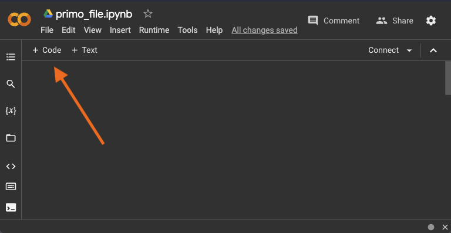
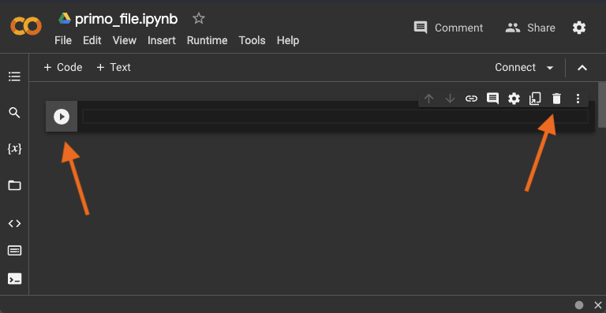
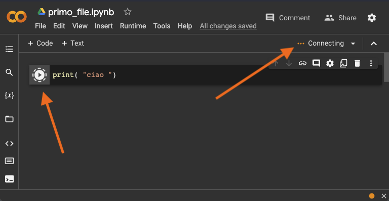
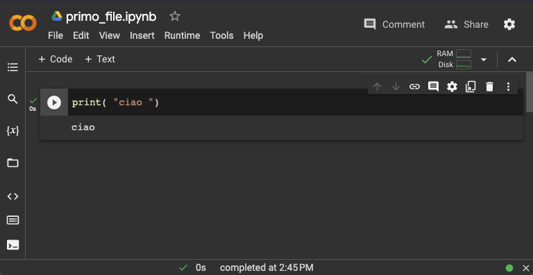
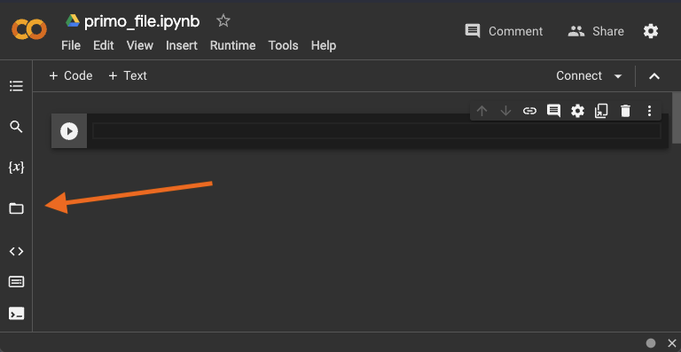
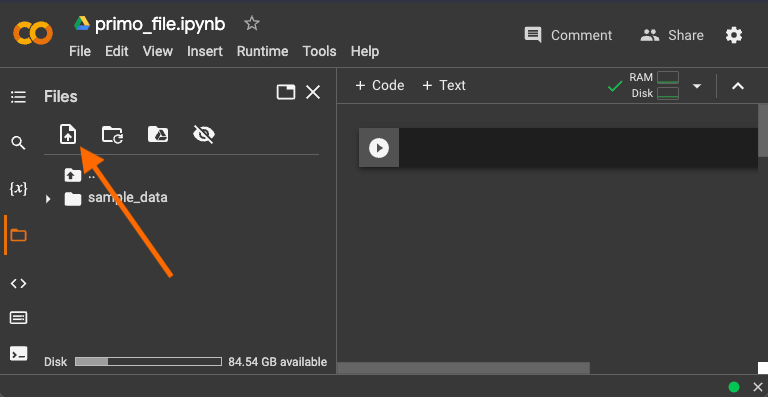
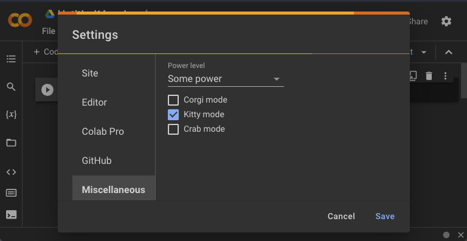

# 00-setup

## Obiettivo
Prendiamo confidenza con gli strumenti che ci serviranno 👩‍💻

Nell'esempio di oggi, scriviamo codice in **Python**, il linguaggio di programmazione più diffuso per sviluppare reti neurali.

Inoltre, anziché programmare con un classico editor di codice (come Visual Studio Code),  utilizziamo uno strumento Google chiamato **Google Colaboratory** (o più semplicemente Colab), un editor per codice Python totalmente online. Colab non richiede installazioni o configurazioni particolari, per questo è perfettamente compatibile con tutti i sistemi operativi (es. Windows, MacOS, Linux).


## Crea un notebook in Colab

1. Accedi a Colab utilizzando il tuo account Google: [https://colab.research.google.com/](https://colab.research.google.com/) (se non hai un account Google, creane uno).
2. Crea un nuovo notebook. Verrà salvato in automatico sul tuo Google Drive in una cartella solitamente chiamata *Colab Notebooks*.
3. I notebook python hanno estensione `.ipynb`. In alto a sinistra, trovi il nome del tuo file, che puoi rinominare come preferisci, es. `primo_file.ipynb`.


### Crea un codice di prova

Un notebook può contenere insieme sia pezzi di codice che pezzi di testo. Per scrivere del codice, crea una cella di codice cliccando sul pulsante `+ Code`.



Nel riquadro puoi scrivere codice esattamente come se stessi usando un editor di codice classico come Visual Studio Code.

A sinistra della cella di codice trovi un pulsante ▶️ per eseguire il codice contenuto in quella cella. In aggiunta, se clicchi dentro la cella, compaiono dei pulsanti a destra, tra cui un cestino 🚮 per cancellare la cella.



Fai una prova a scrivere del codice nella cella ed eseguirla. Incolla nella cella il seguente codice per stampare una stringa:

```
print( "ciao" )
```
Adesso premi sul pulsante ▶️ per eseguire la cella. La prima volta che esegui un nuovo notebook, ci impiegherà qualche secondo per aprire la sessione online (puoi controllare lo stato della connessione in alto a destra). Puoi verificare che la cella di codice è in esecuzione dall'icona del pulsante ▶️ che è cambiata.



Quando l'esecuzione è conclusa, sotto la cella di codice compare un box con il risultato, ovvero `ciao`.




## Utilizza file esterni

Durante l'esempio di oggi, ti servirà leggere dei file esterni da utilizzare all'interno del codice.

Per caricare un file all'interno del notebook, clicca il simbolo della cartella 📁 nella barra a sinistra.



Nel riquadro puoi visualizzare i file che sono presenti nello "storage virtuale" della sessione corrente del tuo notebook. Puoi notare che esiste già una cartella `sample_data` con dei file di esempio (questi non ci serviranno, perciò puoi anche eliminarle la cartella).

Quando avrai bisogno di caricare un tuo file, potrai farlo cliccando sull'icona a sinistra e selezionando il file dal tuo computer.




## Bonus 🤪

Scrivere codice non deve essere un'esperienza noiosa. Se hai bisogno di un livello extra di divertimento, Colab ha un'opzione apposta per te! Accedi alle impostazioni tramite il menu `Tools > Settings`.


Vai sulle impostazioni miscellanee, e prova ad attivare una delle *modalità* oppure azzarda un *power level* superiore! Buon divertimento! 💥🐶🐱🦀




Hai coperto tutte le funzionalità principali di Google Colab! Sei pronta per iniziare 🤩

Puoi procedere con il prossimo step!
| Capitolo successivo                                                                           |
| ---------------------------------------------------------------------------------------------------: |
[01-classificatore-come-funziona ▶︎](../01-classificatore-come-funziona) |
