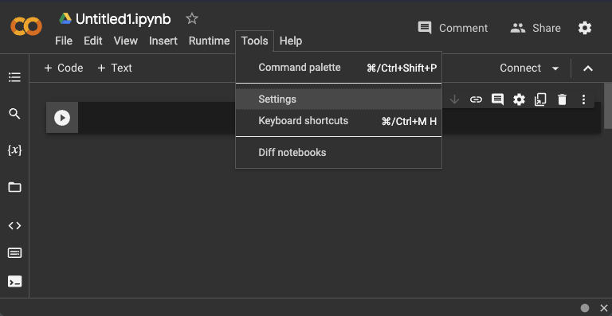

# 00. Setup iniziale

| Capitolo precedente                                                                                                                                          | Capitolo successivo                                                                           |
| :--------------------------------------------------------------------------------------------------------------------------------------------------------------- | ---------------------------------------------------------------------------------------------------: |
| [◀︎ Torna all'inizio](../../..) | [01 Come funziona ChatGPT ▶︎](../01-come-funziona-gpt) |

## Obiettivo
Prendi confidenza con gli strumenti necessari per questo esercizio. 👩‍💻

Nell'esempio di oggi, scriverai codice in **Python**, il linguaggio di programmazione più diffuso per lo sviluppo di reti neurali.

Inoltre, anziché programmare con un classico editor di codice come Visual Studio Code, utilizzerai uno strumento chiamato **Google Colaboratory** (o semplicemente Colab), un editor online per programmare in Python. Colab non richiede installazioni o configurazioni particolari ed è perfettamente compatibile con tutti i sistemi operativi (ad esempio, Windows, macOS, Linux).


## Crea un notebook in Colab

1. Accedi a Colab utilizzando il tuo account Google: [https://colab.research.google.com/](https://colab.research.google.com/) (se non hai un account Google, creane uno).
2. Crea un nuovo notebook. Verrà automaticamente salvato nella tua cartella di Google Drive, solitamente chiamata *Colab Notebooks*.
3. I notebook python hanno estensione `.ipynb`. In alto a sinistra trovi il nome del tuo file, che puoi rinominare a tua scelta, ad esempio `primo_file.ipynb`.


### Crea un codice di prova

Un notebook può contenere sia pezzi di codice che pezzi di testo. Per scrivere del codice, crea una cella di codice cliccando sul pulsante `+ Code`.


Nel riquadro puoi scrivere codice esattamente come se stessi usando un editor di codice classico come Visual Studio Code.

A sinistra della cella di codice, trovi un pulsante ▶️ per eseguire il codice contenuto in quella cella. Inoltre, se clicchi all'interno della cella, compaiono dei pulsanti a destra, tra cui un cestino 🚮 per cancellare la cella.


Fai una prova a scrivere del codice nella cella ed eseguirla. Incolla nella cella il seguente codice per stampare una stringa:

```py
print( "ciao" )
```
Ora premi il pulsante ▶️ per eseguire la cella (oppure utilizza la combinazione di tasti `ctrl + enter` o `cmd + enter`). La prima volta che esegui un nuovo notebook, potrebbe richiedere qualche secondo per aprire la sessione online (puoi verificare lo stato della connessione in alto a destra). Inoltre, puoi verificare che la cella di codice è in esecuzione dall'icona del pulsante ▶️ che è cambiata.


Quando l'esecuzione è conclusa, sotto la cella di codice comparirà un box con il risultato, ovvero `ciao`.


<!--
## Utilizza file esterni

Durante l'esempio di oggi, ti servirà leggere dei file esterni da utilizzare all'interno del codice.

Per caricare un file all'interno del notebook, clicca il simbolo della cartella 📁 nella barra a sinistra.


Nel riquadro puoi visualizzare i file che sono presenti nello "storage virtuale" della sessione corrente del tuo notebook. Puoi notare che esiste già una cartella `sample_data` con dei file di esempio (questi non ci serviranno, perciò puoi anche eliminarle la cartella).

Quando avrai bisogno di caricare un tuo file, potrai farlo cliccando sull'icona a sinistra e selezionando il file dal tuo computer.


-->


## Bonus 🤪

Scrivere codice non deve essere un'esperienza noiosa. Se hai bisogno di un livello extra di divertimento, Colab ha un'opzione apposta per te! Accedi alle impostazioni tramite il menu `Tools > Settings`.



Tra le impostazioni miscellanee, prova ad attivare una delle tre *modalità* 🐶🐱🦀 oppure osa con un *power level* superiore! 💥 Buon divertimento!


Hai coperto tutte le funzionalità principali di Google Colab! Sei pronta per iniziare 🤩

Puoi procedere con il primo capitolo!

| Capitolo precedente                                                                                                                                          | Capitolo successivo                                                                           |
| :--------------------------------------------------------------------------------------------------------------------------------------------------------------- | ---------------------------------------------------------------------------------------------------: |
| [◀︎ Torna all'inizio](../../..) | [01 Come funziona ChatGPT ▶︎](../01-come-funziona-gpt) |
